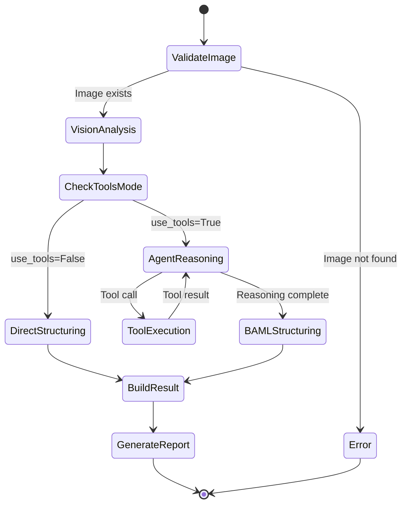
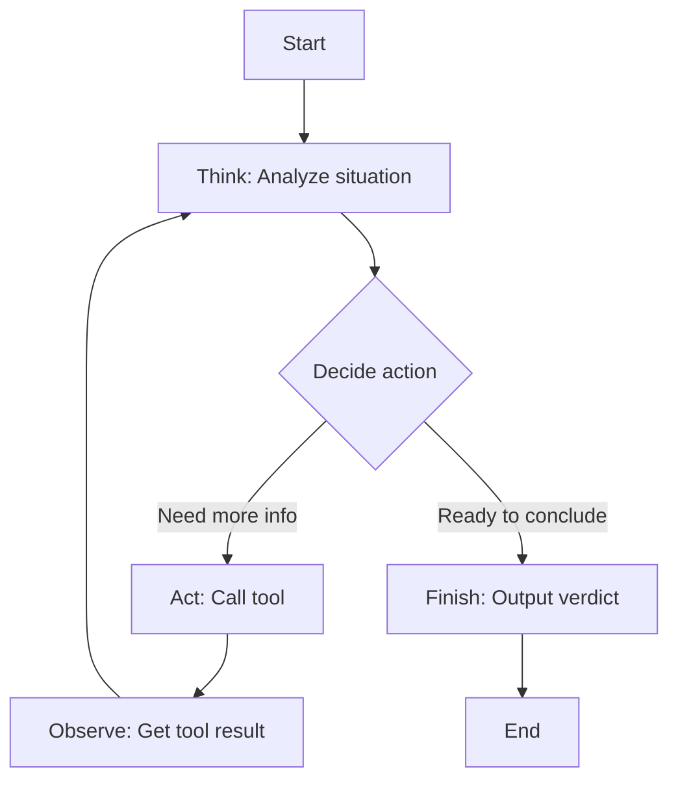

# Agent Pipeline

Deep dive into the ForensicAgent's analysis pipeline and LangGraph integration.

---

## ForensicAgent Class

The `ForensicAgent` class in `src/agents/forensic_agent.py` is the main entry point for analysis.

### Initialization

```python
class ForensicAgent:
    def __init__(
        self,
        llm_model: str = "gpt-5.1",
        vision_model: Optional[str] = None,
        structuring_model: Optional[str] = None,
        temperature: float = 0.0,
        reasoning_effort: Optional[str] = None,
        api_key: Optional[str] = None,
        base_url: Optional[str] = None,
        default_headers: Optional[Dict[str, str]] = None,
        decision_policy: Optional[str] = None,
        max_iterations: Optional[int] = 15,
        enable_checkpointer: bool = True,
    ):
```

### Key Components

| Component | Purpose |
|-----------|---------|
| `self.llm` | ChatOpenAI instance for agent reasoning |
| `self.tools` | List of LangChain Tool objects |
| `self.agent_executor` | LangGraph ReAct agent graph |
| `self.llm_model` | Model identifier for agent |
| `self.vision_model` | Model identifier for vision step |
| `self.structuring_model` | Model identifier for BAML structuring |

---

## Analysis Pipeline

### Main Analysis Method

```python
def analyze(
    self,
    image_path: str,
    user_query: Optional[str] = None,
    use_tools: bool = True,
    pass_image_to_agent: bool = False,
) -> Dict:
```

### Pipeline Stages



---

## Stage 1: Vision Analysis

Every analysis starts with the BAML vision step, regardless of tool mode.

### Implementation

```python
# Phase 0: always get a vision-only description first
vision_result_dict = asyncio.run(
    analyze_vision_only_structured_baml(
        image_path,
        model=self.vision_model,
        api_key=self.api_key,
        base_url=self.base_url,
        default_headers=self.default_headers,
    )
)
```

### Output

```python
{
    "verdict": "fake",
    "confidence": 0.75,
    "rationale": "Multiple anatomical anomalies...",
    "visual_description": "Portrait of a woman...",
    "forensic_summary": "No tools used",
    "full_text": "### Visual Description\n..."
}
```

### Purpose

1. **Initial assessment** — Get visual verdict without tools
2. **Context for agent** — Visual description guides tool selection
3. **Standalone mode** — Complete analysis for `use_tools=False`

---

## Stage 2: Agent Reasoning (Tools Mode)

When `use_tools=True`, the LangGraph ReAct agent takes over.

### Agent Creation

```python
def _create_agent(self):
    """Create LangGraph agent with forensic tools."""
    system_prompt = get_system_prompt()
    
    kwargs = {
        "model": self.llm,
        "tools": self.tools,
        "prompt": system_prompt,
    }
    if self.enable_checkpointer:
        kwargs["checkpointer"] = MemorySaver()
    
    graph = create_react_agent(**kwargs)
    return graph
```

### ReAct Loop

The agent follows the ReAct (Reasoning + Acting) pattern:



### Agent Invocation

```python
# Build message with visual context
agent_prompt = build_agent_prompt(
    visual_summary=visual_summary,
    image_path=image_path
)

messages = [HumanMessage(content=agent_prompt)]

# Invoke agent
config = {
    "configurable": {"thread_id": str(uuid.uuid4())},
    "recursion_limit": 2 * self.max_iterations + 1,
}

result = self.agent_executor.invoke(
    {"messages": messages},
    config=config
)
```

### Tool Execution Tracking

```python
# Track tool usage from agent messages
tool_usage = []
tool_details = []
tool_results = []

for msg in result['messages']:
    if hasattr(msg, 'tool_calls') and msg.tool_calls:
        for tool_call in msg.tool_calls:
            tool_name = tool_call.get('name')
            if tool_name:
                tool_usage.append(tool_name)
    
    if isinstance(msg, ToolMessage):
        tool_name = getattr(msg, "name", "unknown")
        tool_result = msg.content
        # ... record details
```

---

## Stage 3: Output Structuring

The agent's free-form output is structured via BAML.

### Implementation

```python
structured = asyncio.run(structure_analysis_baml(
    output,
    model=self.structuring_model,
    api_key=self.api_key,
    base_url=self.base_url,
    default_headers=self.default_headers,
))
```

### Why Separate Structuring?

Research shows that requiring structured output during reasoning can degrade LLM performance ("reasoning degradation"). By separating:

1. **Reasoning phase** — LLM outputs natural language freely
2. **Structuring phase** — Dedicated call extracts structured data

This approach maintains reasoning quality while ensuring reliable structured output.

---

## Result Building

### Final Result Dictionary

```python
def _build_result(
    self,
    raw_text: str,
    parsed: Optional[Dict[str, Any]],
    tool_usage: List[str],
    image_path: str,
    prompts: Dict[str, str],
) -> Dict[str, Any]:
    return {
        "verdict": self._normalize_verdict(parsed.get("verdict")),
        "confidence": float(parsed.get("confidence", 0.0)),
        "rationale": parsed.get("rationale", ""),
        "visual_description": parsed.get("visual_description", ""),
        "forensic_summary": parsed.get("forensic_summary", ""),
        "raw_text": raw_text,
        "tool_usage": tool_usage,
        "image_path": image_path,
        "prompts": prompts,
        # ... additional fields
    }
```

### Verdict Normalization

```python
@staticmethod
def _normalize_verdict(verdict: Optional[str]) -> str:
    """Normalize verdict to real/fake/uncertain."""
    if not verdict:
        return "uncertain"
    
    v = str(verdict).strip().lower()
    
    fake_tokens = {"fake", "ai-generated", "synthetic", "manipulated", ...}
    real_tokens = {"real", "authentic", "natural", "genuine"}
    uncertain_tokens = {"uncertain", "inconclusive", "unknown", ...}
    
    if v in fake_tokens:
        return "fake"
    if v in real_tokens:
        return "real"
    return "uncertain"
```

---

## Iteration Control

### Max Iterations

The `max_iterations` parameter limits tool calls:

```python
# Calculate recursion_limit from max_iterations
# Each iteration uses 2 steps (action + observation)
config["recursion_limit"] = 2 * self.max_iterations + 1
```

### Default: 15 Iterations

- Allows complex multi-tool investigations
- Prevents infinite loops
- Balances thoroughness with latency

### Adjusting Iterations

```python
# More thorough analysis
agent = ForensicAgent(max_iterations=25)

# Quick analysis
agent = ForensicAgent(max_iterations=5)

# No limit (not recommended)
agent = ForensicAgent(max_iterations=None)
```

---

## Checkpointing

LangGraph's MemorySaver enables:

- Conversation persistence
- State recovery on errors
- Multi-turn interactions

### Enable/Disable

```python
# With checkpointing (default)
agent = ForensicAgent(enable_checkpointer=True)

# Without checkpointing (batch evaluation)
agent = ForensicAgent(enable_checkpointer=False)
```

### Per-Invocation Isolation

Each `analyze()` call uses a unique thread ID:

```python
config = {"configurable": {"thread_id": str(uuid.uuid4())}}
```

This ensures independent analysis sessions.

---

## System Prompt

The agent system prompt defines behavior and tool usage guidance.

### Key Sections

From `src/agents/prompts.py`:

1. **Primary task definition**
2. **Distinction between manipulation and synthesis**
3. **Visual inspection guidelines**
4. **Tool interpretation guidance**
5. **Verdict decision logic**
6. **Output format specification**
7. **SWGDE best practices (appended)**

### Prompt Loading

```python
def get_system_prompt() -> str:
    base_prompt = """You are a forensic image analysis agent..."""
    
    swgde_best_practices = _load_swgde_best_practices_text()
    
    if swgde_best_practices:
        return base_prompt + "\n\n---\n\n" + swgde_best_practices
    return base_prompt
```

**See [Prompts Reference](../reference/prompts.md) for complete prompt documentation.**

---

## Error Handling

### Image Validation

```python
if not os.path.exists(image_path):
    raise FileNotFoundError(f"Image not found: {image_path}")
```

### Tool Errors

Tool errors are captured in results:

```python
tool_details.append({
    "tool": tool_name,
    "seconds": seconds,
    "status": parsed_tool.get("status", "unknown"),
    "error": parsed_tool.get("error"),
})
```

### BAML Structuring Failures

```python
try:
    structured = asyncio.run(structure_analysis_baml(output, ...))
except Exception as e:
    logger.error(f"BAML structuring failed: {e}")
    raise  # BAML is required
```

---

## Timing Instrumentation

### Timing Breakdown

```python
timings: Dict[str, Any] = {}

# Vision step timing
t0 = time.perf_counter()
vision_result = await analyze_vision_only_structured_baml(...)
timings["vision_llm_seconds"] = time.perf_counter() - t0

# Agent step timing
start_time = time.perf_counter()
result = self.agent_executor.invoke(...)
timings["agent_graph_seconds"] = time.perf_counter() - start_time

# Total timing
timings["total_seconds"] = time.perf_counter() - t_total0
```

### Tool-Level Timing

Via timing hook:

```python
def _tool_timing_hook(self, tool_name: str, seconds: float, error: Optional[str]):
    if self._current_tool_timings is not None:
        self._current_tool_timings.append({
            "tool": tool_name,
            "seconds": seconds,
            "error": error,
        })
```

---

## Next Steps

- [BAML Integration](baml-integration.md) — Structured output system
- [Tools Overview](../tools/overview.md) — Forensic tool details
- [API Reference](../api/forensic-agent.md) — Complete API documentation
