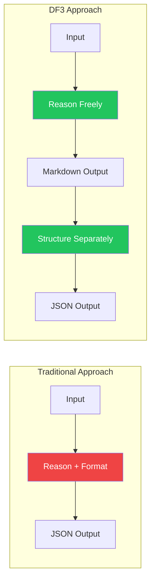

# BAML Integration

How DF3 uses BAML for reliable structured outputs without reasoning degradation.

---

## What is BAML?

BAML (Basically, A Made-Up Language) is a domain-specific language for building LLM functions with structured outputs. It provides:

- **Type-safe outputs** — Guaranteed to match your schema
- **Multi-provider support** — OpenAI, Anthropic, Google, etc.
- **Retry and fallback** — Built-in resilience
- **Prompt templates** — Jinja-like templating

---

## The Reasoning Degradation Problem

Research shows that requiring structured output (JSON) during reasoning can degrade LLM performance:



**Why this happens:**

- JSON formatting constraints reduce available "thinking" capacity
- LLMs may truncate reasoning to fit format
- Schema adherence competes with analytical depth

**DF3's solution:**

1. Let the LLM reason freely in natural language
2. Use a separate call to extract structured data

---

## BAML Files

DF3's BAML definitions are in `baml_src/`:

```
baml_src/
├── clients.baml           # LLM client configurations
├── forensic_analysis.baml # Analysis functions and types
└── generators.baml        # Code generation config
```

### Type Definitions

```baml
// Verdict enum
enum Verdict {
  REAL @description("Image appears authentic and natural")
  FAKE @description("Image appears AI-generated, synthetic, or manipulated")
  UNCERTAIN @description("Insufficient evidence or conflicting indicators")
}

// Structured output schema
class ForensicAnalysisResult {
  verdict Verdict
  confidence float @assert(between_0_and_1, {{ this >= 0.0 and this <= 1.0 }})
  rationale string @description("Brief justification for the verdict (max 80 words)")
  visual_description string @description("Description of what is in the image")
  forensic_summary string @description("Summary of forensic tools used or 'No tools used'")
  full_text string @description("Complete formatted narrative combining all sections")
}
```

### Function Definitions

**Vision-only (unstructured reasoning):**

```baml
function AnalyzeImageVisionOnly(image: image) -> string {
  client DynamicForensicClient
  prompt #"
    You are a forensic image analyst...
    
    Provide your analysis in MARKDOWN format...
    
    {{ _.role("user") }} {{ image }}
  "#
}
```

**Structuring (extract structured data):**

```baml
function StructureForensicAnalysis(reasoning_output: string) -> ForensicAnalysisResult {
  client DynamicForensicClient
  prompt #"
    Extract structured information from this forensic analysis reasoning output...
    
    {{ reasoning_output }}
    
    {{ ctx.output_format }}
  "#
}
```

---

## Client Configuration

### Dynamic Client Override

DF3 uses a dynamic client that can be overridden at runtime:

```baml
// Default client (overridden at runtime)
client<llm> DynamicForensicClient {
  provider openai-responses
  retry_policy Exponential
  options {
    model "gpt-5-mini"  // Default, overridden by Python
    api_key env.OPENAI_API_KEY
  }
}
```

### Python Client Registry

```python
def _create_client_registry(
    model: str,
    api_key: Optional[str] = None,
    base_url: Optional[str] = None,
    default_headers: Optional[Dict[str, str]] = None,
) -> baml_py_core.ClientRegistry:
    """Create a BAML ClientRegistry that overrides DynamicForensicClient."""
    
    cr = baml_py_core.ClientRegistry()
    
    options = {
        "model": model,
        "api_key": api_key or os.environ.get("OPENAI_API_KEY"),
    }
    
    if base_url:
        options["base_url"] = base_url
    
    # Choose provider based on endpoint
    provider = "openai-responses"
    if base_url and "openrouter.ai" in str(base_url).lower():
        provider = "openai"  # OpenRouter uses Chat Completions API
    
    cr.add_llm_client(
        name="DynamicForensicClient",
        provider=provider,
        options=options,
    )
    
    return cr
```

---

## Python Integration

### BAML Function Calls

From `src/agents/baml_forensic.py`:

**Vision-only structured:**

```python
async def analyze_vision_only_structured_baml(
    image_path: str,
    model: Optional[str] = None,
    api_key: Optional[str] = None,
    base_url: Optional[str] = None,
    default_headers: Optional[Dict[str, str]] = None,
) -> Dict[str, Any]:
    """Combined vision-only analysis with structured output."""
    
    # Load image as BAML Image type
    with open(image_path, "rb") as f:
        encoded = base64.b64encode(f.read()).decode('utf-8')
    image = BamlImage.from_base64(mime_type, encoded)
    
    # Create client registry with specified model
    client_registry = _create_client_registry(model, api_key, base_url, default_headers)
    
    # Call BAML function
    result = await b.AnalyzeImageVisionOnlyStructured(
        image,
        baml_options={"client_registry": client_registry}
    )
    
    # Convert to dictionary
    return {
        "verdict": result.verdict.value.lower(),
        "confidence": result.confidence,
        "rationale": result.rationale,
        "visual_description": result.visual_description,
        "forensic_summary": result.forensic_summary,
        "full_text": result.full_text,
    }
```

**Structuring:**

```python
async def structure_analysis_baml(
    reasoning_output: str,
    model: Optional[str] = None,
    ...
) -> Dict[str, Any]:
    """Structure unstructured reasoning output."""
    
    client_registry = _create_client_registry(model, ...)
    
    result = await b.StructureForensicAnalysis(
        reasoning_output,
        baml_options={"client_registry": client_registry}
    )
    
    return {
        "verdict": result.verdict.value.lower(),
        "confidence": result.confidence,
        # ...
    }
```

---

## Vision Cache Integration

BAML vision outputs are cached to avoid redundant API calls:

```python
async def analyze_vision_only_structured_baml(...):
    # Check cache first
    if get_cache is not None:
        cache = get_cache()
        cached_result = cache.get_vision_output(
            vision_model=model,
            image_path=image_path,
            cache_tag=_vision_cache_tag(),
        )
        if cached_result is not None:
            return cached_result
    
    # ... perform analysis ...
    
    # Store in cache
    if get_cache is not None:
        cache.set_vision_output(
            vision_model=model,
            image_path=image_path,
            output=result,
            cache_tag=_vision_cache_tag(),
        )
    
    return result
```

### Cache Tag

The cache tag ensures cache invalidation when prompts change:

```python
def _vision_cache_tag() -> str:
    """Return cache discriminator based on BAML file hash."""
    # Check environment override
    env = os.getenv("DF3_VISION_CACHE_TAG")
    if env:
        return str(env)
    
    # Hash the BAML source file
    baml_path = repo_root / "baml_src" / "forensic_analysis.baml"
    if baml_path.exists():
        h = hashlib.sha256(baml_path.read_bytes()).hexdigest()[:16]
        return f"baml:{h}"
    
    return "unknown"
```

---

## Regenerating the Client

After modifying `baml_src/*.baml` files:

```bash
pip install baml-py  # If not installed
baml-cli generate
```

This regenerates `baml_client/`:

```
baml_client/
├── __init__.py
├── async_client.py      # Async function calls
├── sync_client.py       # Sync function calls
├── types.py             # Type definitions
├── config.py
└── ...
```

---

## Best Practices

### Prompt Design

1. **Include `{{ ctx.output_format }}`** — Tells BAML to insert schema instructions
2. **Use `{{ _.role("user") }}`** — Marks where user content starts
3. **Don't repeat schema fields** — BAML handles this
4. **Keep prompts focused** — Let reasoning happen, don't over-constrain

**See [Prompts Reference](../reference/prompts.md) for complete BAML prompt documentation.**

### Type Design

1. **Use enums for categories** — `Verdict` instead of free-form string
2. **Add descriptions** — Help the LLM understand field purposes
3. **Use assertions** — `@assert` for constraints like confidence bounds
4. **Keep structures flat** — Avoid deep nesting when possible

### Error Handling

```python
try:
    result = await b.StructureForensicAnalysis(text, ...)
except BamlValidationError as e:
    # Output didn't match schema
    logger.error(f"Validation failed: {e}")
except BamlClientFinishReasonError as e:
    # LLM stopped unexpectedly
    logger.error(f"Finish reason error: {e}")
```

---

## Supported Providers

BAML supports multiple LLM providers:

| Provider | BAML Provider Name | Notes |
|----------|-------------------|-------|
| OpenAI | `openai-responses` | Responses API (preferred) |
| OpenAI | `openai` | Chat Completions API |
| Anthropic | `anthropic` | Claude models |
| Google | `google-ai` | Gemini models |
| Azure | `azure-openai` | Azure-hosted OpenAI |
| Vertex AI | `vertex-ai` | Google Cloud |
| AWS Bedrock | `aws-bedrock` | AWS-hosted models |

### OpenRouter Configuration

For OpenRouter, use the `openai` provider (Chat Completions):

```python
if "openrouter.ai" in base_url:
    provider = "openai"  # Not openai-responses
```

---

## Next Steps

- [System Overview](overview.md) — Complete architecture
- [API Reference](../api/baml-functions.md) — BAML function reference
- [Configuration](../reference/configuration.md) — Model configuration
