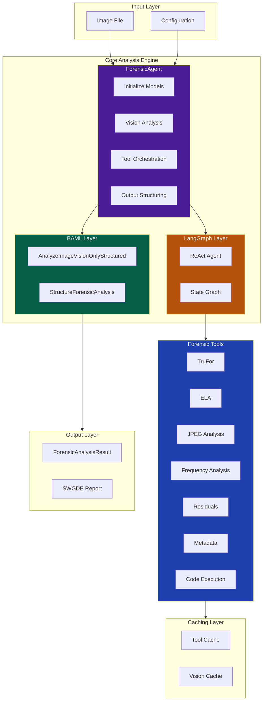
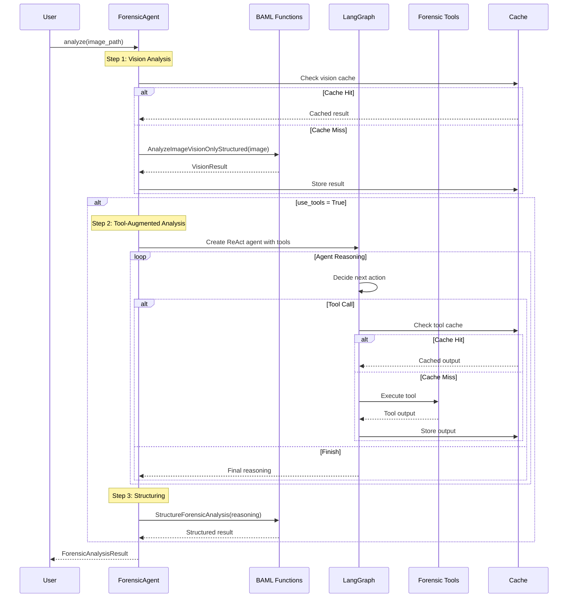
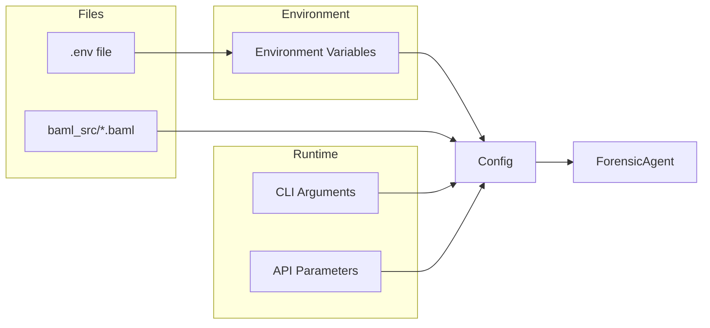

# System Overview

Technical architecture of DF3's forensic image analysis system.

---

## High-Level Architecture



---

## Component Overview

### Entry Points

| Component | Path | Purpose |
|-----------|------|---------|
| `analyze_image.py` | `scripts/` | Single image analysis CLI |
| `evaluate_llms.py` | `scripts/` | Batch evaluation CLI |
| `ForensicAgent` | `src/agents/` | Programmatic API |

### Core Engine

| Component | Path | Purpose |
|-----------|------|---------|
| `ForensicAgent` | `src/agents/forensic_agent.py` | Main orchestrator class |
| `baml_forensic.py` | `src/agents/` | BAML function wrappers |
| `prompts.py` | `src/agents/` | System and user prompts |

### Forensic Tools

| Component | Path | Purpose |
|-----------|------|---------|
| `forensic_tools.py` | `src/tools/` | Tool registration for LangGraph |
| `trufor_tools.py` | `src/tools/forensic/` | TruFor neural forgery detection |
| `ela_tools.py` | `src/tools/forensic/` | Error Level Analysis |
| `jpeg_tools.py` | `src/tools/forensic/` | JPEG compression analysis |
| `frequency_tools.py` | `src/tools/forensic/` | DCT/FFT frequency analysis |
| `noise_tools.py` | `src/tools/forensic/` | DRUNet residual extraction |
| `metadata_tools.py` | `src/tools/forensic/` | EXIF/XMP/C2PA extraction |
| `code_execution_tool.py` | `src/tools/forensic/` | Dynamic Python execution |

### Support Systems

| Component | Path | Purpose |
|-----------|------|---------|
| `cache.py` | `src/tools/forensic/` | Tool and vision output caching |
| `weight_downloader.py` | `src/utils/` | Auto-download model weights |
| `image_auth_report.py` | `src/reporting/` | SWGDE-style report generation |

---

## Directory Structure

```
df3/
├── baml_src/                   # BAML function definitions
│   ├── clients.baml            # LLM client configurations
│   ├── forensic_analysis.baml  # Analysis functions
│   └── generators.baml         # Code generation config
│
├── baml_client/                # Generated BAML Python client
│   ├── async_client.py
│   ├── sync_client.py
│   └── types.py
│
├── src/
│   ├── agents/
│   │   ├── forensic_agent.py   # Main agent class
│   │   ├── baml_forensic.py    # BAML integration
│   │   ├── prompts.py          # Prompt definitions
│   │   └── evidence_normalizer.py
│   │
│   ├── tools/
│   │   ├── forensic/           # Tool implementations
│   │   │   ├── trufor_tools.py
│   │   │   ├── ela_tools.py
│   │   │   ├── jpeg_tools.py
│   │   │   ├── frequency_tools.py
│   │   │   ├── noise_tools.py
│   │   │   ├── metadata_tools.py
│   │   │   ├── code_execution_tool.py
│   │   │   ├── cache.py
│   │   │   ├── drunet/         # DRUNet model
│   │   │   └── trufor_support/ # TruFor model
│   │   └── forensic_tools.py   # Tool registration
│   │
│   ├── reporting/
│   │   └── image_auth_report.py
│   │
│   └── utils/
│       └── weight_downloader.py
│
├── scripts/
│   ├── analyze_image.py        # Single image CLI
│   ├── evaluate_llms.py        # Batch evaluation
│   └── summarize_results.py    # Results aggregation
│
├── weights/
│   └── trufor/
│       └── trufor.pth.tar      # TruFor weights (~180MB)
│
├── tests/                      # Test suite
├── docs/                       # Legacy docs
├── markdown_docs/              # MkDocs documentation
└── results/                    # Evaluation results
```

---

## Data Flow

### Single Image Analysis



---

## Key Design Decisions

### Two-Step Structured Output

**Problem:** Requiring JSON output during reasoning degrades LLM performance.

**Solution:** Separate reasoning from structuring:

1. Vision/Agent step: Free-form markdown output
2. Structuring step: Extract structured data via BAML

**Implementation:** `StructureForensicAnalysis` in `forensic_analysis.baml`

### Agentic Tool Selection

**Problem:** Fixed tool pipelines can't adapt to image content.

**Solution:** LangGraph ReAct agent decides which tools to use based on:

- Initial visual analysis results
- Previous tool outputs
- Remaining uncertainty

**Implementation:** `create_react_agent` with `create_forensic_tools()` in `forensic_agent.py`

### Three-Way Classification

**Problem:** Binary classifiers force incorrect answers on ambiguous cases.

**Solution:** Include `uncertain` as a valid verdict for:

- Conflicting evidence
- Low confidence
- Image quality issues

**Implementation:** `Verdict` enum in `forensic_analysis.baml`

### Transparent Caching

**Problem:** Repeated analyses waste compute; stale caches invalidate experiments.

**Solution:** Cache with versioning:

- Tool outputs cached by (tool_name, image_hash, params)
- Vision outputs cached with prompt hash
- Cache tag prevents stale reads after prompt changes

**Implementation:** `ToolCache` in `cache.py`

---

## Technology Stack

### Core Dependencies

| Package | Version | Purpose |
|---------|---------|---------|
| **LangChain** | 0.3+ | LLM abstraction layer |
| **LangGraph** | 0.2+ | Agent orchestration |
| **BAML** | 0.70+ | Structured LLM outputs |
| **PyTorch** | 2.0+ | Neural network backend |
| **OpenAI SDK** | 1.0+ | API client |

### Image Processing

| Package | Purpose |
|---------|---------|
| **Pillow** | Image loading and manipulation |
| **OpenCV** | Advanced image processing |
| **NumPy** | Numerical operations |
| **SciPy** | Scientific computing |

### Development

| Package | Purpose |
|---------|---------|
| **pytest** | Testing |
| **ruff** | Linting and formatting |
| **mypy** | Type checking |
| **MkDocs** | Documentation |

---

## Configuration Layers



**Precedence (highest to lowest):**

1. API/CLI parameters
2. Environment variables
3. `.env` file
4. BAML defaults
5. Code defaults

---

## Next Steps

- [Agent Pipeline](agent-pipeline.md) — Detailed agent architecture
- [BAML Integration](baml-integration.md) — Structured output system
- [Tools Overview](../tools/overview.md) — Forensic tool details
