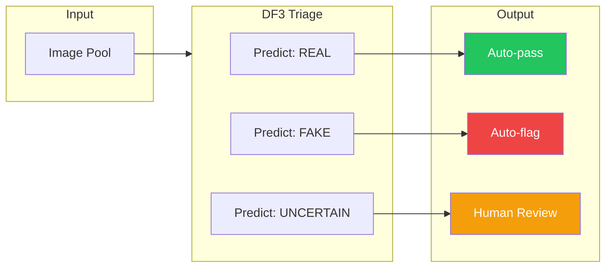

# Evaluation Methodology

How DF3 evaluates performance and what the metrics mean.

---

## Evaluation Framework

DF3's evaluation is designed for **selective classification** (triage), not forced binary classification. This means:

- The system can output `uncertain` instead of guessing
- Metrics measure both accuracy and coverage
- Human review is part of the intended workflow

---

## The Three-Way Triage Model



### Why Three-Way?

Traditional binary classifiers force a decision:

- **Problem**: Ambiguous cases get wrong answers
- **Cost**: False positives and false negatives have real impact

Three-way triage enables:

- **Appropriate uncertainty**: "I don't know" is valid
- **Intelligent routing**: Hard cases go to humans
- **Calibrated confidence**: Trust high-confidence decisions

---

## Metric Categories

### Primary Metrics

| Metric | Formula | Meaning |
|--------|---------|---------|
| **accuracy** | (TP + TN) / N | Overall correct rate (abstentions = wrong) |
| **accuracy_answered** | (TP + TN) / answered | Correct rate among answered samples |
| **coverage** | answered / N | Fraction of samples answered |

### Class-Specific Metrics

| Metric | Description |
|--------|-------------|
| **precision_fake** | TP / (TP + FP) — When we say "fake", how often correct? |
| **recall_fake** | TP / (TP + FN) — What fraction of fakes do we catch? |
| **f1_fake** | Harmonic mean of precision and recall for fake class |
| **precision_real** | TN / (TN + FN) — When we say "real", how often correct? |
| **recall_real** | TN / (TN + FP) — What fraction of reals do we pass? |
| **f1_real** | Harmonic mean for real class |

### Triage-Specific Metrics

| Metric | Formula | Meaning |
|--------|---------|---------|
| **fake_slip_rate** | FN / N_fake | Fakes incorrectly passed as real |
| **real_false_flag_rate** | FP / N_real | Reals incorrectly flagged as fake |
| **fake_catch_rate** | TP / N_fake | Fakes correctly caught |
| **real_pass_rate** | TN / N_real | Reals correctly passed |

### Balanced Metrics

| Metric | Formula | Meaning |
|--------|---------|---------|
| **balanced_accuracy** | (TPR_fake + TPR_real) / 2 | Balanced across classes |
| **MCC** | Matthews Correlation Coefficient | Handles class imbalance |

---

## Confusion Matrix

For three-way classification:

```
                    Predicted
                    REAL    FAKE    UNCERTAIN
            REAL    TN      FP      Abstain_real
Ground      FAKE    FN      TP      Abstain_fake
Truth
```

### Treatment of Abstentions

| Metric Type | Abstention Treatment |
|-------------|---------------------|
| **Overall accuracy** | Count as wrong |
| **Answered-only metrics** | Exclude from calculation |
| **Coverage** | Measures how often we answer |
| **Class-conditional** | Track separately by ground truth |

---

## Evaluation Protocol

### Dataset Requirements

```json
{"id": "sample-001", "image": "path/to/image.jpg", "label": "real"}
{"id": "sample-002", "image": "path/to/image.jpg", "label": "fake"}
```

- **Balanced classes** — Equal or known ratio of real/fake
- **Known ground truth** — Labels are accurate
- **Representative samples** — Reflect intended use case

### Standard Evaluation

```powershell
python scripts/evaluate_llms.py \
    --dataset data/benchmark.jsonl \
    --models gpt-5.1 \
    --tools both \
    --temperature 0.0 \
    --output results.jsonl \
    --metrics-output metrics.json
```

### Multi-Trial Evaluation

For variance estimation:

```powershell
python scripts/evaluate_llms.py \
    --dataset data/benchmark.jsonl \
    --models gpt-5.1 \
    --trials 5 \
    --temperature 0.0
```

---

## Statistical Comparisons

### McNemar Test

For comparing tools vs no-tools on the same samples:

```python
# In summarize_results.py
# Tests whether discordant pairs are equally distributed
# H0: No difference between configurations
# p < 0.05 suggests significant difference
```

### Wilson Confidence Intervals

95% confidence intervals for accuracy and coverage:

```python
# Wilson score interval for binomial proportions
# More accurate than normal approximation for small samples
```

---

## Calibration Diagnostics

### Expected Calibration Error (ECE)

Measures how well confidence predicts accuracy:

```
ECE = Σ (|bin_count| / n) × |accuracy(bin) - confidence(bin)|
```

- **Low ECE** — Confidence predicts accuracy well
- **High ECE** — Confidence is miscalibrated

### Brier Score

Mean squared error of probabilistic predictions:

```
Brier = (1/n) × Σ (confidence - correct)²
```

- **Lower is better**
- **Range**: 0 (perfect) to 1 (worst)

---

## Latency Considerations

### Cache Effects

!!! warning "Caching Confounds Latency"
    When tool cache is enabled, latency may reflect cache hits (<250ms) rather than actual computation. For valid latency comparisons:
    
    - Disable caching: `--disable-tool-cache`
    - Or report cache-hit vs cache-miss separately

### Timing Breakdown

Results include timing components:

```json
{
    "timings": {
        "vision_llm_seconds": 3.2,
        "agent_graph_seconds": 8.5,
        "total_seconds": 12.1
    }
}
```

---

## Reproducibility Requirements

For scientifically valid evaluation:

### Control Variables

| Variable | Recommendation |
|----------|---------------|
| Temperature | `0.0` for determinism |
| Model version | Document exact model ID |
| Prompt version | Hash prompts, track changes |
| Cache state | Disable or document |

### Record Provenance

Each result should include:

- Model identifiers (agent, vision, structuring)
- Prompt hashes
- Cache state
- Timestamp

---

## Comparing Configurations

### Valid Comparisons

| Comparison | Requirements |
|------------|-------------|
| Model A vs Model B | Same dataset, same mode |
| Tools vs No-Tools | Same model, same dataset |
| Vision model variants | Same agent model, same dataset |

### Invalid Comparisons

| Comparison | Problem |
|------------|---------|
| Different datasets | Different difficulty |
| Different sample sizes | Statistical power differs |
| Mixed cache states | Latency not comparable |
| Different prompts | Different behavior |

---

## Interpretation Guidelines

### What High Accuracy Means

- System correctly classifies most images
- But: may be conservative (high abstention)

### What High Coverage Means

- System answers most questions
- But: may be less accurate on hard cases

### Ideal Characteristics

- **High accuracy_answered** — When we answer, we're right
- **Reasonable coverage** — We answer most cases
- **Low slip rates** — Few fakes pass through
- **Low false-flag rates** — Few reals incorrectly flagged

---

## See Also

- [Metrics Reference](metrics.md) — Detailed metric definitions
- [Benchmark Results](results.md) — Current evaluation results
- [Reproducibility](../research/reproducibility.md) — Reproduction guidelines
