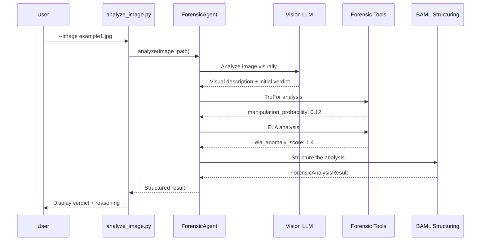

# Your First Analysis

A detailed walkthrough of analyzing an image with DF3, explaining each step and output.

---

## Sample Analysis

Let's analyze an example image step by step. We'll use an image from the `example_images/` folder.

### Running the Analysis

```powershell
python scripts/analyze_image.py --image example_images/example1.jpg
```

### What Happens Behind the Scenes



---

## Understanding the Output

Here's a complete sample output with annotations:

```
Initializing forensic agent with model: gpt-5.1...

Analyzing image: example_images/example1.jpg
------------------------------------------------------------

==============================================================
ANALYSIS RESULTS
==============================================================

Verdict: REAL                           # ← Final determination
Confidence: 0.82                        # ← 0-1 scale confidence score

Rationale: The image shows consistent characteristics of an 
authentic photograph. Natural skin texture with visible pores, 
proper finger count and hand anatomy, coherent lighting with 
shadows matching the apparent light source, and no semantic 
anomalies detected. TruFor returned a low manipulation 
probability (0.12), supporting authenticity.

Visual Description: Outdoor portrait photograph of a middle-aged 
man wearing a blue polo shirt. Natural daylight illumination from 
the upper left. Background shows out-of-focus trees and grass.

Tools used: perform_trufor, perform_ela

==============================================================
IMAGE AUTHENTICATION REPORT (SWGDE-STYLE)
==============================================================
[Detailed forensic report follows...]
```

### Verdict Values

| Verdict | Meaning |
|---------|---------|
| `REAL` | Image appears to be an authentic photograph |
| `FAKE` | Image appears to be AI-generated or manipulated |
| `UNCERTAIN` | Evidence is insufficient or conflicting — needs human review |

### Confidence Score

The confidence score (0.0 - 1.0) indicates the system's certainty:

| Range | Interpretation |
|-------|----------------|
| 0.8 - 1.0 | High confidence — strong evidence supports the verdict |
| 0.5 - 0.8 | Medium confidence — some evidence, possible ambiguity |
| 0.0 - 0.5 | Low confidence — weak or conflicting evidence |

!!! warning "Confidence is Self-Reported"
    The confidence score is the LLM's self-assessment, not a calibrated probability. Use it for relative ranking, not as a precise likelihood.

---

## Different Analysis Modes

### Vision-Only Analysis

For faster analysis without forensic tools:

```powershell
python scripts/analyze_image.py --image photo.jpg --no-tools
```

**When to use:**

- Quick screening of many images
- When tool latency is a concern
- For obvious AI-generated images (visual cues sufficient)

**Output differences:**

- Faster execution (no tool calls)
- Relies entirely on visual analysis
- `Tools used: (none)`

### Tool-Augmented Analysis

Full analysis with forensic tools (default):

```powershell
python scripts/analyze_image.py --image photo.jpg
```

**When to use:**

- High-stakes decisions
- Manipulated image detection (splicing, editing)
- When visual analysis is uncertain

**Available tools:**

- `perform_trufor` — Neural forgery detection
- `perform_ela` — Error Level Analysis
- `metadata` — EXIF/metadata extraction
- `analyze_jpeg_compression` — JPEG artifact analysis
- `detect_jpeg_quantization` — Quantization table analysis
- `analyze_frequency_domain` — FFT/DCT frequency analysis
- `extract_residuals` — DRUNet noise analysis

---

## Asking Specific Questions

You can ask specific questions about an image:

```powershell
python scripts/analyze_image.py \
    --image photo.jpg \
    --query "Is this person's face a deepfake?"
```

The agent will focus its analysis on the specific question, examining:

- Face consistency and realism
- Boundary artifacts around the face
- Skin texture and lighting coherence

---

## Working with Different Image Formats

DF3 supports common image formats:

| Format | Support | Notes |
|--------|---------|-------|
| JPEG (.jpg, .jpeg) | ✅ Full | Best for ELA, JPEG tools |
| PNG (.png) | ✅ Full | JPEG-specific tools auto-skip |
| WebP (.webp) | ✅ Partial | Some tools may skip |
| GIF (.gif) | ⚠️ Limited | First frame only |
| TIFF (.tiff) | ✅ Partial | Large files may be slow |

!!! note "JPEG-Specific Tools"
    Tools like `perform_ela` and `detect_jpeg_quantization` only apply to JPEG images. They automatically skip for other formats with an informative message.

---

## Reading the Forensic Report

The SWGDE-style report provides detailed documentation:

```markdown
## Image Authentication Report

**Examiner:** DF3 Automated Analysis
**Date:** 2026-01-15
**File:** example1.jpg

### Evidence Information
- File Size: 1.2 MB
- Resolution: 3840 x 2160
- Format: JPEG

### Analysis Methods
1. Visual Inspection (LLM-based)
2. TruFor Forgery Detection
3. Error Level Analysis

### Observations
[Detailed findings from each method...]

### Conclusion
Based on the analysis of both image content and image structure,
the image appears authentic with high confidence (0.82).

### Limitations
- Analysis performed on compressed version
- No reference images available for comparison
- Results should be verified by qualified examiner
```

---

## Saving Results

### JSON Output

Get machine-readable output:

```python
from src.agents import ForensicAgent

agent = ForensicAgent(llm_model="gpt-5.1")
result = agent.analyze("photo.jpg")

# Result is a dictionary
print(result['verdict'])      # "real", "fake", or "uncertain"
print(result['confidence'])   # 0.0 - 1.0
print(result['rationale'])    # Explanation string
print(result['tool_usage'])   # List of tools used
```

### Result Fields

| Field | Type | Description |
|-------|------|-------------|
| `verdict` | string | "real", "fake", or "uncertain" |
| `confidence` | float | 0.0 - 1.0 confidence score |
| `rationale` | string | Explanation of the verdict |
| `visual_description` | string | Description of image contents |
| `forensic_summary` | string | Summary of tool findings |
| `tool_usage` | list | Names of tools invoked |
| `tool_results` | list | Detailed tool outputs |
| `timings` | dict | Execution timing breakdown |
| `models` | dict | Models used (agent, vision, structuring) |

---

## Next Steps

Now that you've completed your first analysis:

<div class="feature-grid" markdown>

<div class="feature-card" markdown>
### :material-magnify: How It Works
Understand the agent architecture and decision process.

[How It Works →](../guide/how-it-works.md)
</div>

<div class="feature-card" markdown>
### :material-tools: Forensic Tools
Learn what each tool detects and when to use it.

[Tools Overview →](../tools/overview.md)
</div>

<div class="feature-card" markdown>
### :material-chart-bar: Batch Evaluation
Evaluate performance on labeled datasets.

[Batch Evaluation →](../guide/batch-evaluation.md)
</div>

<div class="feature-card" markdown>
### :material-api: API Reference
Use DF3 programmatically in your applications.

[API Reference →](../api/forensic-agent.md)
</div>

</div>
