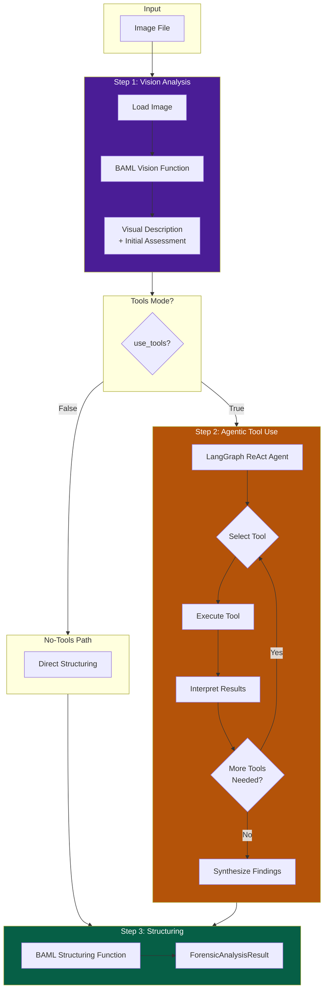
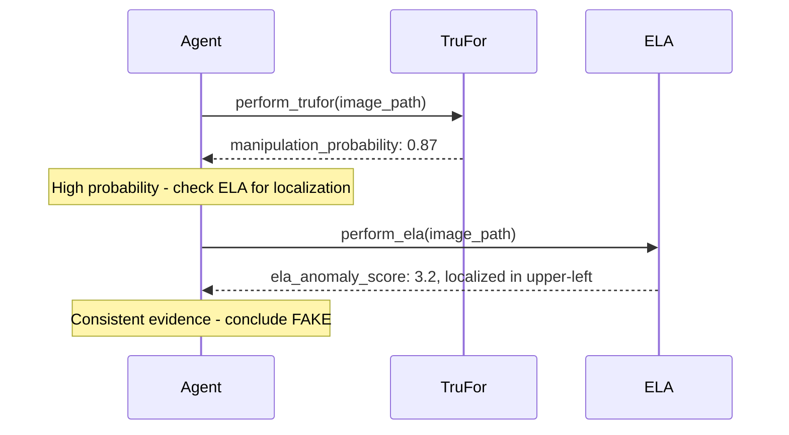

# How DF3 Works

DF3 uses an agent-based architecture to analyze images for signs of AI generation or manipulation. This page explains the core concepts and decision-making process.

---

## The Core Philosophy

Traditional image forensics tools produce numeric scores that require expert interpretation. DF3 takes a different approach:

1. **Vision-First** — The LLM examines the image directly, like a human expert would
2. **Tool-Augmented** — Forensic tools provide technical evidence to support or challenge visual observations
3. **Transparent Reasoning** — Every verdict includes explanations, not just scores
4. **Selective Classification** — The system can say "I'm not sure" instead of guessing

---

## The Two-Type Problem

A key insight in DF3's design is that "fake" images come in two fundamentally different forms:

### Manipulated Images

Images that started as real photographs but were edited:

- **Splicing** — Pasting elements from other images
- **Copy-move** — Duplicating regions within the image
- **Inpainting** — AI-assisted removal or addition
- **Retouching** — Color, lighting, or feature alterations

**Detection approach:** Forensic tools excel here. TruFor, ELA, and compression analysis detect local inconsistencies where edits were made.

### AI-Generated Images

Images created entirely by AI generators:

- **Text-to-image** — DALL-E, Midjourney, Stable Diffusion
- **GAN-generated** — StyleGAN, ProGAN faces
- **Deepfakes** — Face swaps and reenactments

**Detection approach:** Visual analysis is key. AI-generated images often appear internally consistent to forensic tools (no "editing" artifacts), but contain telltale visual anomalies.

!!! important "Why This Matters"
    A low TruFor score does NOT mean an image is real — it means the image hasn't been *edited*. A fully synthetic image can score low on manipulation tools because it was never manipulated; it was generated from scratch.

---

## The Analysis Pipeline



---

## Step 1: Vision Analysis

Every analysis starts with the vision step, regardless of whether tools are enabled.

### What the Vision LLM Looks For

The vision model examines the image for indicators of AI generation:

#### Anatomical Errors
- Wrong number of fingers, teeth, or eyes
- Malformed hands or impossible poses
- Asymmetric or distorted facial features

#### Texture Anomalies
- Unnaturally smooth skin lacking pores
- Repeating patterns in backgrounds
- "Painted" or "waxy" appearance

#### Lighting Inconsistencies
- Shadows pointing in different directions
- Missing or impossible reflections
- Light sources that don't match shadows

#### Semantic Impossibilities
- Objects that don't make sense in context
- Garbled or nonsensical text
- Background elements that defy physics

### Vision Output

The vision step produces:

```python
{
    "visual_description": "Portrait of a woman in her 30s...",
    "synthesis_indicators": "Possible extra finger on left hand...",
    "verdict": "fake",
    "confidence": 0.75,
    "rationale": "Multiple anatomical anomalies suggest..."
}
```

---

## Step 2: Tool-Augmented Analysis

When `use_tools=True`, the LangGraph ReAct agent takes over.

### How the Agent Decides

The agent receives:
1. The visual description from Step 1
2. The image path
3. Access to forensic tools

It then reasons about which tools would be most useful:

```
Initial visual analysis suggests possible manipulation in the 
background region. I should:
1. Run TruFor to check for manipulation probability
2. Run ELA to look for localized compression anomalies
```

### Tool Selection Logic

| Visual Observation | Likely Tool Choice |
|--------------------|-------------------|
| Possible splicing/compositing | TruFor, ELA |
| JPEG-looking image | detect_jpeg_quantization, analyze_jpeg_compression |
| Unusual textures/patterns | extract_residuals, analyze_frequency_domain |
| Metadata questions | metadata |
| Need custom analysis | execute_python_code |

### Tool Iteration

The agent can call multiple tools, typically 1-3 per analysis:



---

## Step 3: Structuring

The final step converts free-form reasoning into structured output.

### Why Separate Structuring?

Research shows that requiring structured output during reasoning can degrade LLM performance. DF3 uses a two-step approach:

1. **Reasoning** — LLM thinks freely in natural language
2. **Structuring** — Separate call extracts structured data

This is implemented via BAML's `StructureForensicAnalysis` function.

### Final Output Schema

```python
class ForensicAnalysisResult:
    verdict: Literal["real", "fake", "uncertain"]
    confidence: float  # 0.0 - 1.0
    rationale: str     # Max 80 words
    visual_description: str
    forensic_summary: str
    full_text: str     # Complete narrative
```

---

## Decision Logic

### When to Say "FAKE"

Strong fake signals (any of these):

- TruFor `manipulation_probability` > 0.8
- Clear visual anomalies (wrong anatomy, impossible physics)
- High ELA anomaly scores with localized patterns
- Multiple corroborating signals

### When to Say "REAL"

Strong real signals (need multiple):

- Natural appearance with no visual anomalies
- TruFor `manipulation_probability` < 0.2
- Consistent lighting, physics, and anatomy
- Valid metadata with plausible provenance

### When to Say "UNCERTAIN"

Appropriate uncertainty:

- Mid-range tool scores (0.3 - 0.6)
- Conflicting evidence (visual says fake, tools say real)
- Low image quality prevents reliable analysis
- Evidence is genuinely ambiguous

!!! tip "Uncertain is Valid"
    `uncertain` is not a failure — it's an appropriate response when evidence doesn't support a confident verdict. It enables intelligent triage to human reviewers.

---

## Evidence Weighting

### Visual vs Tool Evidence

DF3 weighs evidence differently based on image type:

| Evidence Source | AI-Generated | Manipulated |
|-----------------|--------------|-------------|
| Visual analysis | Primary | Supporting |
| TruFor | Supporting | Primary |
| ELA | Neutral | Primary |
| Frequency analysis | Supporting | Supporting |

### Conflicting Evidence

When visual and tool evidence conflict:

1. **Visual says fake, tools say clean** → Likely AI-generated (tools don't detect synthesis)
2. **Visual says real, tools say fake** → Trust tools (they detect things humans miss)
3. **Both ambiguous** → Report uncertain

---

## Performance Considerations

### Latency Breakdown

Typical analysis times:

| Step | No-Tools Mode | Tools Mode |
|------|---------------|------------|
| Vision LLM call | 2-5s | 2-5s |
| Tool execution | — | 3-15s |
| Agent reasoning | — | 2-8s |
| Structuring | 1-2s | 1-2s |
| **Total** | **3-7s** | **8-30s** |

### Caching

DF3 caches:

- **Vision outputs** — Keyed by image hash + model + prompt hash
- **Tool outputs** — Keyed by image hash + tool name + parameters

Enable/disable via `--enable-tool-cache` / `--disable-tool-cache`.

---

## Next Steps

<div class="feature-grid" markdown>

<div class="feature-card" markdown>
### :material-tools: Forensic Tools
Deep dive into each tool and what it detects.

[Tools Overview →](../tools/overview.md)
</div>

<div class="feature-card" markdown>
### :material-code-braces: Architecture
Technical details of the system implementation.

[System Overview →](../architecture/overview.md)
</div>

</div>
