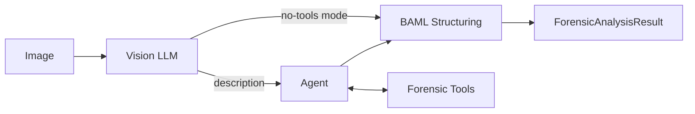

# DF3 — Forensic Image Analysis

**Agentic forensic image analysis for detecting AI-generated and manipulated images**

DF3 combines vision-capable large language models with specialized forensic tools to classify images as `real`, `fake`, or `uncertain`. The system provides structured verdicts with transparent reasoning.

[:material-rocket-launch: Quick Start](getting-started/quickstart.md){ .md-button .md-button--primary }
[:material-book-open-variant: User Guide](guide/how-it-works.md){ .md-button }
[:material-chart-bar: Evaluation Results](evaluation/results.md){ .md-button }

---

## Overview

DF3 targets three categories:

- **AI-generated images** — Fully synthetic (DALL-E, Midjourney, Stable Diffusion)
- **Manipulated images** — Edited photographs (splicing, inpainting)
- **Deepfakes** — Face swaps and identity manipulations

The agent-based approach:

1. Analyzes the image visually for synthesis/manipulation artifacts
2. Invokes forensic tools to gather technical evidence
3. Synthesizes findings into a structured verdict with reasoning

---

## Two Operating Modes

| Mode | Description | Latency |
|------|-------------|---------|
| **Vision-Only** | Pure LLM visual analysis | 2-10s |
| **Tool-Augmented** | Agent invokes forensic tools | 30-90s |

---

## Forensic Tools

| Tool | Purpose |
|------|---------|
| **TruFor** | Neural forgery detection |
| **ELA** | Error Level Analysis (JPEG) |
| **JPEG Analysis** | Quantization table analysis |
| **Frequency Analysis** | DCT/FFT patterns |
| **Residual Extraction** | DRUNet noise analysis |
| **Metadata** | EXIF/XMP/C2PA extraction |
| **Code Execution** | Custom Python analysis |

---

## Quick Example

```powershell
# Single image
python scripts/analyze_image.py --image photo.jpg

# Vision-only (faster)
python scripts/analyze_image.py --image photo.jpg --no-tools

# Batch evaluation
python scripts/evaluate_llms.py --dataset data/eval.jsonl --models gpt-5.1
```

**Output:**

```
Verdict: FAKE
Confidence: 0.87

Rationale: The image shows clear signs of AI generation including 
malformed fingers (6 digits), unnaturally smooth skin texture, 
and inconsistent lighting/shadow direction.

Tools used: perform_trufor, perform_ela
```

---

## Architecture



---

## Three-Way Classification

Unlike binary classifiers, DF3 can output `uncertain` for ambiguous cases:

- **High confidence** → Automated processing
- **Low confidence** → Human review
- **Conflicting evidence** → Expert analysis

---

## Model Support

DF3 uses [LangChain](https://www.langchain.com/) and [BAML](https://boundaryml.ai/) libraries for model API integration, standardized on either OpenRouter-style or OpenAI-style API calls. **Any vision-capable model that supports tool calling (at least in prompt format) is supported**, including:

- Models accessible via OpenAI-compatible endpoints (cloud or local)
- Models accessible via OpenRouter
- Locally run LLMs (via OpenAI-compatible local servers or LangChain's local integrations)
- Any provider supported by LangChain's model integrations

The system does not require specific model implementations—it works with any model that can process images and handle tool/function calling semantics, whether hosted remotely or running locally.

---

## Getting Started

| Step | Link |
|------|------|
| Install | [Installation Guide](getting-started/installation.md) |
| First analysis | [Quick Start](getting-started/quickstart.md) |
| Configure | [Configuration](reference/configuration.md) |
| Evaluate | [Batch Evaluation](guide/batch-evaluation.md) |

---

## Documentation Structure

| Section | Contents |
|---------|----------|
| **Getting Started** | Installation, quickstart, first analysis |
| **User Guide** | Workflows, interpreting results |
| **Architecture** | System design, BAML integration |
| **Forensic Tools** | Tool reference |
| **Evaluation** | Methodology, metrics, results |
| **Reference** | Configuration, troubleshooting |
| **Research** | Limitations, reproducibility |
