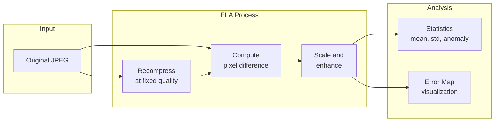

# Error Level Analysis (ELA)

Error Level Analysis is a classic forensic technique that detects localized editing by comparing compression artifacts across image regions.

---

## Overview

**ELA** (Error Level Analysis) works by recompressing an image at a fixed JPEG quality and measuring the pixel-wise difference. Regions that were edited or pasted from different sources often compress differently, producing higher error levels.

| Aspect | Detail |
|--------|--------|
| **Purpose** | Detect localized JPEG editing/manipulation |
| **Technique** | Recompression difference analysis |
| **Input** | **JPEG only** (skips other formats) |
| **Output** | Error statistics and optional visualization |

---

## How It Works



### The Principle

When a JPEG image is saved, each 8x8 block is compressed based on its content. If regions were:

- **Saved at different quality levels** — They'll compress differently
- **Pasted from other images** — Their compression history differs
- **Edited after saving** — The edited areas haven't been compressed as much

### Visual Example

```
Original image regions:
┌─────────────────────────────┐
│ Photo at quality 85         │
│   ┌───────────┐             │
│   │ Pasted    │ ← Saved at  │
│   │ element   │   quality 95│
│   └───────────┘             │
│                             │
└─────────────────────────────┘

ELA output:
┌─────────────────────────────┐
│ Low error (dark)            │
│   ┌───────────┐             │
│   │ HIGH      │ ← Anomaly!  │
│   │ ERROR     │             │
│   └───────────┘             │
│                             │
└─────────────────────────────┘
```

---

## Usage

### Tool Call Format

```json
{
    "path": "/path/to/image.jpg",
    "quality": 75
}
```

### Parameters

| Parameter | Type | Default | Description |
|-----------|------|---------|-------------|
| `path` | string | required | Path to JPEG image |
| `quality` | int | 75 | Recompression quality (1-100) |

### Output Format

```json
{
    "tool": "perform_ela",
    "status": "completed",
    "image_path": "/path/to/image.jpg",
    "quality": 75,
    "ela_mean": 12.5,
    "ela_std": 8.3,
    "ela_anomaly_score": 2.1,
    "ela_map": null,
    "ela_map_size": null,
    "note": "ELA recompresses at fixed JPEG quality..."
}
```

---

## Interpreting Results

### Anomaly Score

The `ela_anomaly_score` is a z-score of the 95th percentile vs mean:

| Score Range | Interpretation |
|-------------|----------------|
| **0.0 - 1.5** | Normal compression consistency |
| **1.5 - 2.5** | Slight anomalies — may be natural variation |
| **2.5 - 4.0** | Moderate anomalies — investigate further |
| **4.0+** | Strong anomalies — likely localized editing |

### Mean and Standard Deviation

- **ela_mean** — Average error level across the image
- **ela_std** — Variation in error levels

Higher values generally indicate more processing, but interpretation depends on:

- Original image quality
- Content complexity
- Compression history

---

## JPEG-Only Restriction

!!! warning "JPEG Only"
    ELA is fundamentally a JPEG recompression technique. Running it on PNG, WebP, or other formats produces misleading results.
    
    DF3 automatically skips ELA for non-JPEG inputs:
    
    ```json
    {
        "tool": "perform_ela",
        "status": "skipped",
        "reason": "ELA is JPEG-specific; skipping for .png input."
    }
    ```

---

## Limitations

### False Positives

ELA can produce high anomaly scores from:

1. **Watermarks and overlays** — Always show high error
2. **Text and graphics** — Sharp edges compress differently
3. **Heavy recompression** — Multiple saves accumulate artifacts
4. **Platform processing** — Social media processing confounds analysis

### False Negatives

ELA may miss manipulation when:

1. **Same quality** — Edited region saved at same quality as original
2. **Careful blending** — Skilled editors minimize compression differences
3. **AI-generated content** — Internally consistent compression

### Compression Confounds

- **Multi-generation** — Images saved repeatedly show uniform high error
- **Quality changes** — Resaving at different quality affects entire image
- **Format conversion** — JPEG→PNG→JPEG destroys meaningful signals

---

## Best Practices

### For Analysis

1. **Use on first-generation JPEGs** when possible
2. **Compare to similar regions** — Backgrounds should be uniform
3. **Look for localized anomalies** — Not overall high scores
4. **Combine with TruFor** — Corroborating evidence is stronger

### Quality Parameter Selection

| Original Quality | Recommended ELA Quality |
|------------------|------------------------|
| Unknown | 75 (default) |
| High (90+) | 85-90 |
| Medium (70-90) | 70-80 |
| Low (<70) | 60-70 |

Generally, use a quality slightly below the estimated original quality.

---

## Technical Details

### Algorithm

```python
def perform_ela(image_path, quality=75):
    # Load original
    original = load_image(image_path)
    
    # Recompress at fixed quality
    recompressed = save_as_jpeg(original, quality)
    recompressed = load_image(recompressed)
    
    # Compute difference
    difference = abs(original - recompressed)
    
    # Scale for visibility
    ela_map = sqrt(difference / 255) * scale_factor
    
    # Compute statistics
    mean = average(ela_map)
    std = standard_deviation(ela_map)
    p95 = percentile_95(ela_map)
    anomaly_score = (p95 - mean) / (std + epsilon)
    
    return ela_map, mean, std, anomaly_score
```

### Implementation Notes

- Based on Sherloq ELA implementation
- Uses non-linear scaling (sqrt) for better visualization
- Applies contrast adjustment via LUT
- Outputs color (RGB) map by default

---

## Enabling the Map Output

The error map is disabled by default. Enable it programmatically:

```python
from src.tools.forensic import perform_ela
import json

result = perform_ela(json.dumps({
    "path": "image.jpg",
    "quality": 75,
    "return_map": True,
    "max_size": 1024  # Limit map dimensions
}))

output = json.loads(result)
# output["ela_map"] contains base64 PNG
```

---

## See Also

- [TruFor](trufor.md) — Neural forgery detection
- [JPEG Analysis](jpeg.md) — Compression artifact analysis
- [Tools Overview](overview.md) — Complete tool reference
