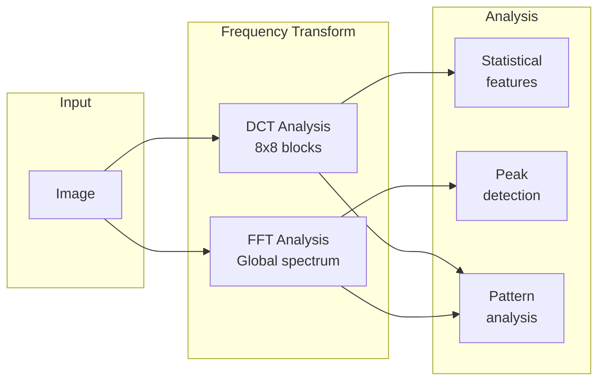

# Frequency Analysis

Analyzes image frequency domain features using DCT and FFT transforms to detect synthetic regularities and processing artifacts.

---

## Overview

**Frequency analysis** examines an image's representation in the frequency domain, where:

- **Low frequencies** — Represent smooth gradients and large features
- **High frequencies** — Represent edges, texture, and fine detail

AI-generated images and processed images often exhibit unusual frequency characteristics.

| Aspect | Detail |
|--------|--------|
| **Purpose** | Detect synthetic regularities and processing artifacts |
| **Technique** | DCT (Discrete Cosine Transform) and FFT (Fast Fourier Transform) |
| **Input** | Any common image format |
| **Output** | Frequency domain statistics |

---

## How It Works



### What Each Transform Reveals

**DCT (Discrete Cosine Transform):**

- Block-based analysis matching JPEG compression
- Reveals quantization patterns
- Useful for detecting JPEG artifacts

**FFT (Fast Fourier Transform):**

- Global frequency spectrum
- Reveals periodic patterns across entire image
- Can detect AI-generated regularities

---

## Usage

### Tool Call Format

```
/path/to/image.jpg
```

### Output Format

```json
{
    "tool": "analyze_frequency_domain",
    "status": "completed",
    "image_path": "/path/to/image.jpg",
    "dct_features": {
        "mean_energy": 12500.3,
        "energy_distribution": [0.45, 0.25, 0.15, 0.08, 0.07],
        "blocking_score": 0.23
    },
    "fft_features": {
        "spectral_centroid": 45.2,
        "spectral_flatness": 0.78,
        "peak_frequencies": [...]
    },
    "note": "Frequency domain analysis for anomaly detection..."
}
```

---

## Interpreting Results

### DCT Features

| Feature | Meaning |
|---------|---------|
| `mean_energy` | Overall frequency content |
| `energy_distribution` | How energy is distributed across frequency bands |
| `blocking_score` | Strength of 8x8 block artifacts (JPEG signature) |

### FFT Features

| Feature | Meaning |
|---------|---------|
| `spectral_centroid` | "Center of mass" of frequency content |
| `spectral_flatness` | How evenly distributed frequencies are |
| `peak_frequencies` | Dominant periodic patterns |

### What to Look For

**Signs of AI generation:**

- Unusual frequency peaks not matching natural images
- Periodic patterns in the spectrum
- Abnormal energy distribution

**Signs of processing:**

- Strong JPEG blocking in DCT
- Upscaling artifacts in FFT (periodic peaks)
- Smoothing/sharpening signatures

---

## Limitations

### Content Dependence

Frequency characteristics vary greatly with content:

- **Natural scenes** — Rich, distributed spectrum
- **Graphics/text** — Sparse, sharp peaks
- **Portraits** — Moderate frequency content

!!! note "Comparison Required"
    Interpret frequency results by comparing to similar content types, not absolute thresholds.

### Not Definitive

Frequency analysis alone is rarely conclusive:

- Many AI generators produce natural-looking spectra
- Post-processing can mask anomalies
- Natural images can have unusual spectra

Use as corroborating evidence with other tools.

---

## Technical Background

### DCT Transform

The DCT represents image blocks as sums of cosine functions:

```
For each 8x8 block:
F(u,v) = C(u)C(v)/4 × ΣΣ f(x,y) × cos[(2x+1)uπ/16] × cos[(2y+1)vπ/16]
```

**Properties:**

- Energy compaction — Most energy in low-frequency coefficients
- JPEG compatible — Same transform used in JPEG compression
- Block-based — Analyzes local frequency content

### FFT Transform

The FFT decomposes the entire image into sinusoidal components:

```
F(u,v) = ΣΣ f(x,y) × e^(-j2π(ux/M + vy/N))
```

**Properties:**

- Global analysis — Sees patterns across entire image
- Periodic detection — Reveals repeating patterns
- Phase information — Can detect subtle regularities

---

## Forensic Applications

### Detecting Upscaling

Upscaled images show characteristic FFT patterns:

```
Natural image FFT:     Upscaled image FFT:
┌─────────────────┐    ┌─────────────────┐
│       •         │    │   •   •   •     │
│     •   •       │    │       •         │
│   •   X   •     │    │ •   • X •   •   │
│     •   •       │    │       •         │
│       •         │    │   •   •   •     │
└─────────────────┘    └─────────────────┘
                       ↑ Periodic peaks
```

### Detecting AI Generation

Some AI generators leave frequency fingerprints:

- GAN artifacts create specific spectral signatures
- Diffusion models may show unusual high-frequency patterns
- Upscaling networks leave characteristic marks

---

## Best Practices

### For Analysis

1. **Compare to references** — What does a similar authentic image look like?
2. **Look for anomalies** — Unusual peaks or patterns
3. **Consider context** — Content type affects expected spectrum
4. **Combine evidence** — Use with other tools

### When Useful

| Scenario | Frequency Analysis Value |
|----------|-------------------------|
| Suspected upscaling | High — clear signature |
| JPEG history investigation | Moderate — DCT features help |
| AI generation detection | Variable — depends on generator |
| General manipulation | Low — other tools better |

---

## See Also

- [Residual Analysis](residuals.md) — Noise-based analysis
- [TruFor](trufor.md) — Neural forgery detection
- [Tools Overview](overview.md) — Complete tool reference
