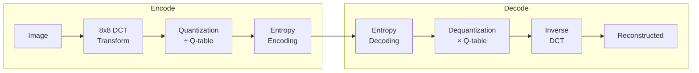

# JPEG Analysis Tools

Two tools analyze JPEG compression artifacts: `analyze_jpeg_compression` for general compression analysis and `detect_jpeg_quantization` for quantization table analysis.

---

## Overview

JPEG compression artifacts carry forensic information about an image's processing history. These tools examine:

- **Quantization tables** — Quality settings used during compression
- **Double compression** — Signs of recompression at different qualities
- **Blocking artifacts** — 8x8 DCT block patterns

| Tool | Purpose | Key Output |
|------|---------|------------|
| `analyze_jpeg_compression` | General compression analysis | Compression artifacts, quality indicators |
| `detect_jpeg_quantization` | Quantization table analysis | Quality estimate, double-compression flags |

!!! warning "JPEG Only"
    Both tools automatically skip for non-JPEG inputs.

---

## detect_jpeg_quantization

### Purpose

Extract and analyze JPEG quantization tables to:

- Estimate original compression quality
- Detect double-compression (different quality saves)
- Identify standard vs custom quantization tables

### Usage

```
/path/to/image.jpg
```

### Output

```json
{
    "tool": "detect_jpeg_quantization",
    "status": "completed",
    "image_path": "/path/to/image.jpg",
    "estimated_quality": 85,
    "luminance_table": [...],
    "chrominance_table": [...],
    "double_compression_indicators": {
        "periodic_patterns": false,
        "table_mismatch": false
    },
    "note": "Quantization tables and quality estimation..."
}
```

### Interpreting Quality Estimates

| Estimated Quality | Interpretation |
|------------------|----------------|
| **95-100** | High quality, minimal compression loss |
| **85-95** | Good quality, typical for cameras |
| **70-85** | Moderate compression, web-optimized |
| **< 70** | Heavy compression, quality degraded |

### Double Compression Detection

Double compression occurs when a JPEG is opened and re-saved. Indicators:

1. **Periodic DCT patterns** — Statistical anomalies in coefficient distribution
2. **Quality mismatch** — Tables don't match standard quality levels
3. **Blocking artifacts** — Visible 8x8 grid patterns

---

## analyze_jpeg_compression

### Purpose

Broader compression artifact analysis including:

- Overall compression quality assessment
- Artifact visibility metrics
- Compression history indicators

### Usage

```
/path/to/image.jpg
```

### Output

```json
{
    "tool": "analyze_jpeg_compression",
    "status": "completed",
    "image_path": "/path/to/image.jpg",
    "compression_analysis": {
        "blocking_artifacts": 0.15,
        "quality_estimate": 82,
        "compression_ratio": 12.5
    },
    "note": "JPEG compression artifact analysis..."
}
```

---

## Forensic Applications

### Quality Mismatch Detection

If different regions have different quality characteristics:

```
┌─────────────────────────────┐
│ Quality 85 throughout       │
│   ┌───────────┐             │
│   │ Quality   │ ← Pasted    │
│   │    95     │   from      │
│   └───────────┘   elsewhere │
│                             │
└─────────────────────────────┘
```

This indicates:

- Element was saved at different quality
- Possible splicing from another source
- Requires additional verification

### Double-Compression History

When an image is re-saved:

1. Original DCT coefficients are quantized
2. Re-quantization at different quality creates periodic patterns
3. These patterns are detectable via statistical analysis

---

## Limitations

### Common Issues

1. **Platform recompression** — Social media re-encodes all uploads
2. **Unknown original** — Can't compare to original quality
3. **Standard tables** — Many cameras use standard quantization
4. **Multiple re-saves** — Patterns become ambiguous

### When Analysis is Inconclusive

- Single compression can't rule out manipulation
- Standard quality tables are common
- Heavy compression masks subtle differences

---

## Best Practices

### For Analysis

1. **Compare to known sources** — Device-specific tables are identifiable
2. **Look for inconsistencies** — Uniform quality is expected
3. **Combine with ELA** — Corroborating compression evidence
4. **Consider context** — Social media processing confounds

### When to Use

| Scenario | Tool Choice |
|----------|-------------|
| Quality estimation | `detect_jpeg_quantization` |
| Double-compression check | `detect_jpeg_quantization` |
| General artifact analysis | `analyze_jpeg_compression` |
| Both for thorough analysis | Use both tools |

---

## Technical Background

### JPEG Compression Overview



### Quantization Tables

The quantization table determines quality/size tradeoff:

- **Lower values** → Less quantization → Higher quality
- **Higher values** → More quantization → Smaller files

Standard tables are scaled by quality factor (1-100).

### Double Compression Artifacts

When re-saving at different quality:

```
DCT coefficients after first save: [32, 0, -8, 0, 4, ...]
                                    ↓ (quantized by Q1)
After dequantization: [32, 0, -8, 0, 4, ...]
                                    ↓ (re-quantized by Q2)
DCT coefficients after second save: [35, 0, -9, 0, 5, ...]
```

The mismatch creates periodic patterns in coefficient distributions.

---

## See Also

- [ELA](ela.md) — Compression-based editing detection
- [TruFor](trufor.md) — Neural forgery detection
- [Tools Overview](overview.md) — Complete tool reference
