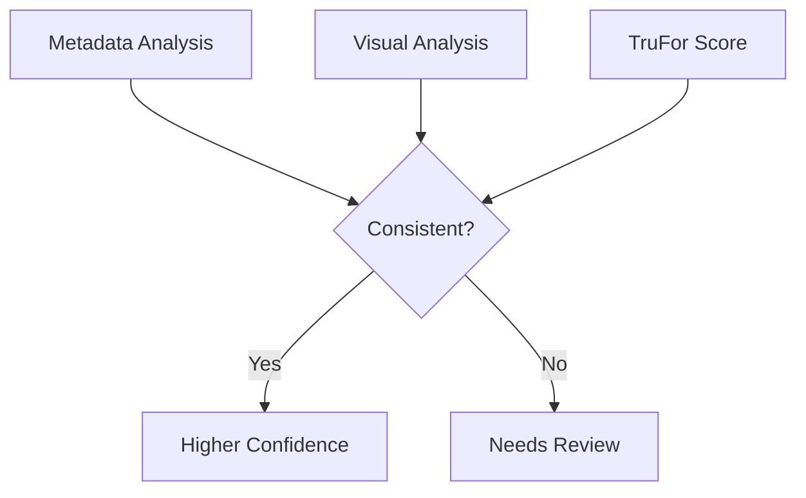

# Metadata & C2PA Analysis

Extraction and interpretation of image metadata including EXIF, XMP, ICC profiles, and Content Credentials (C2PA).

---

## Overview

The `metadata` tool extracts embedded information from image files that can reveal provenance, capture details, and processing history.

---

## Metadata Types

### EXIF (Exchangeable Image File Format)

**Standard metadata embedded by cameras:**

| Field | Forensic Value |
|-------|---------------|
| Make/Model | Camera identification |
| DateTimeOriginal | Capture timestamp |
| GPSInfo | Location (if enabled) |
| ExposureTime | Camera settings |
| Software | Processing software |
| ImageDescription | User annotations |

### XMP (Extensible Metadata Platform)

**Adobe's metadata standard:**

| Field | Forensic Value |
|-------|---------------|
| CreatorTool | Editing software |
| History | Edit history |
| DerivedFrom | Source file reference |
| DocumentID | Unique identifier |

### ICC Profile

**Color management information:**

| Field | Forensic Value |
|-------|---------------|
| ProfileDescription | Color space name |
| ProfileCreator | Creating software |
| Creation date | Profile timestamp |

### C2PA (Content Credentials)

**Cryptographic provenance standard:**

| Field | Forensic Value |
|-------|---------------|
| has_c2pa_manifest | Presence of credentials |
| is_valid_c2pa | Cryptographic validity |
| c2pa_actions | Recorded modifications |
| claim_generator | Creating software |

---

## Tool Output

### Example Output

```json
{
    "tool": "metadata",
    "status": "completed",
    "image_path": "photo.jpg",
    "exif_data": {
        "Make": "Canon",
        "Model": "EOS R5",
        "DateTimeOriginal": "2025:12:15 14:30:00",
        "GPSLatitude": 37.7749,
        "GPSLongitude": -122.4194,
        "Software": "Adobe Photoshop 25.0"
    },
    "xmp_data": {
        "CreatorTool": "Adobe Photoshop 25.0",
        "History": [
            {"action": "created", "when": "2025-12-15T14:30:00"},
            {"action": "saved", "when": "2025-12-15T15:45:00"}
        ]
    },
    "icc_profile_summary": {
        "description": "sRGB IEC61966-2.1",
        "color_space": "RGB"
    },
    "c2pa_data": {
        "has_c2pa_manifest": false,
        "is_valid_c2pa": null,
        "c2pa_actions": []
    },
    "file_info": {
        "file_size_bytes": 2456789,
        "format": "JPEG"
    },
    "note": "Metadata extraction complete. Camera: Canon EOS R5. Software: Adobe Photoshop 25.0."
}
```

---

## Forensic Interpretation

### Presence vs. Absence

| Scenario | Interpretation |
|----------|---------------|
| Full EXIF present | Consistent with camera capture |
| EXIF stripped | Common with social media, could be intentional |
| Software tag present | Image was processed |
| C2PA valid | Strong provenance evidence |
| C2PA invalid | Tampering or corruption possible |

### Suspicious Indicators

!!! warning "Red Flags"
    - EXIF timestamps inconsistent with claimed date
    - Camera model doesn't match image characteristics
    - Multiple software tags suggesting heavy processing
    - Invalid or corrupted C2PA manifest
    - GPS coordinates inconsistent with claimed location

### Benign Explanations

Not all metadata anomalies indicate manipulation:

- **Social media stripping** — Platforms routinely remove metadata
- **Privacy protection** — Users intentionally remove GPS/camera info
- **Format conversion** — Converting formats can lose metadata
- **Legitimate editing** — Color correction, cropping adds software tags

---

## C2PA Deep Dive

### What is C2PA?

The **Coalition for Content Provenance and Authenticity (C2PA)** defines a standard for cryptographically signed metadata that tracks content creation and modification.

### C2PA Verification

```
Manifest present → Check signature validity
  ↓
Valid signature → Check claim chain
  ↓
Valid chain → Review recorded actions
```

### Interpretation

| C2PA Status | Meaning |
|-------------|---------|
| `has_c2pa_manifest: true, is_valid_c2pa: true` | Verified provenance |
| `has_c2pa_manifest: true, is_valid_c2pa: false` | Tampered or corrupted |
| `has_c2pa_manifest: false` | No credentials (common) |

### Actions Recorded

C2PA manifests may record:

- `c2pa.created` — Initial creation
- `c2pa.edited` — Modifications
- `c2pa.cropped` — Cropping operations
- `c2pa.resized` — Size changes
- `c2pa.filtered` — Filter applications

---

## Limitations

### Metadata Can Be Forged

!!! danger "Metadata is Not Proof"
    Metadata can be easily manipulated. EXIF data, timestamps, and GPS coordinates can be altered or fabricated using common tools.

### Absence Is Not Evidence

Missing metadata doesn't indicate manipulation:

- Many legitimate workflows strip metadata
- Social media platforms remove it
- Privacy-conscious users remove it

### C2PA Adoption

- Relatively new standard
- Not yet widely deployed
- Absence is normal (for now)

---

## Usage

### Tool Invocation

```python
# Agent calls metadata tool
result = agent.call_tool("metadata", "path/to/image.jpg")
```

### Command Line

```powershell
# Analysis includes metadata by default
python scripts/analyze_image.py --image photo.jpg
```

---

## Best Practices

### When Metadata Supports Authenticity

Strong evidence when:

- EXIF matches claimed camera/date
- C2PA manifest is valid
- Edit history is minimal and consistent
- GPS matches claimed location

### When Metadata Raises Questions

Investigate further when:

- Timestamps are impossible or inconsistent
- Camera model seems wrong for image quality
- Multiple editing software in history
- C2PA signature is invalid
- Metadata seems too perfect (possibly fabricated)

### Integration with Other Tools

Metadata should corroborate other evidence:



---

## See Also

- [Tools Overview](overview.md) — All forensic tools
- [TruFor](trufor.md) — Neural forgery detection
- [SWGDE Best Practices](../reference/swgde.md) — Forensic standards
