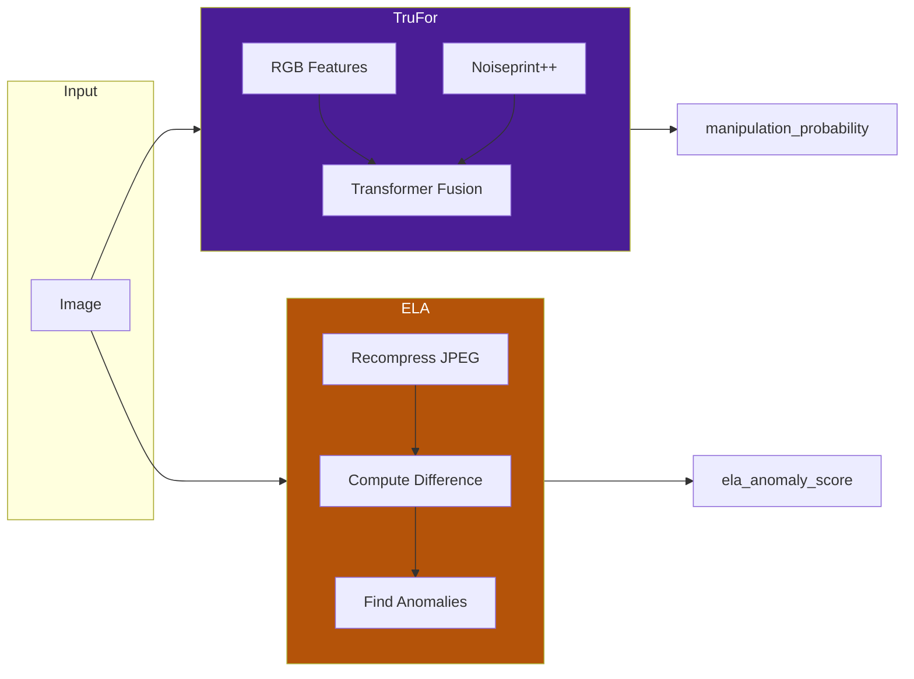

# Forensic Tools Overview

DF3 includes seven specialized forensic analysis tools. This page provides an overview of the toolchain; see individual tool pages for detailed documentation.

---

## Tool Summary

| Tool | Purpose | Best For | Input Requirements |
|------|---------|----------|-------------------|
| [**TruFor**](trufor.md) | Neural forgery detection | Manipulation, splicing | Any image format |
| [**ELA**](ela.md) | Error Level Analysis | JPEG editing detection | JPEG only |
| [**JPEG Analysis**](jpeg.md) | Compression artifacts | Double compression | JPEG only |
| [**Frequency Analysis**](frequency.md) | DCT/FFT patterns | Synthetic regularities | Any format |
| [**Residual Analysis**](residuals.md) | Noise pattern analysis | Generation artifacts | Any format |
| [**Metadata**](metadata.md) | EXIF/XMP/C2PA | Provenance, tampering | Any format |
| [**Code Execution**](code-execution.md) | Custom Python | Specialized analysis | Any format |

---

## Tool Selection Philosophy

The DF3 agent decides which tools to use based on:

1. **Image format** — JPEG-specific tools skip for PNG/WebP
2. **Initial visual analysis** — What artifacts were observed
3. **Investigation needs** — What questions need answering

### Typical Tool Selection Patterns

| Scenario | Likely Tools |
|----------|--------------|
| Suspected manipulation/editing | TruFor, ELA |
| Suspected AI generation | Frequency analysis, residuals |
| Unknown provenance | Metadata, TruFor |
| JPEG quality questions | JPEG analysis, detect_jpeg_quantization |
| Need custom analysis | Code execution |

---

## Tool Categories

### Manipulation Detectors

**TruFor** and **ELA** are primary manipulation detectors:



**Key distinction:**

- **TruFor** — AI-driven, detects subtle manipulation patterns
- **ELA** — Classic technique, detects compression inconsistencies

### Format Analyzers

**JPEG tools** analyze compression artifacts:

- `analyze_jpeg_compression` — Overall compression analysis
- `detect_jpeg_quantization` — Quality estimation, double-compression detection

!!! note "JPEG Only"
    These tools automatically skip for non-JPEG inputs with an informative message.

### Signal Analyzers

**Frequency** and **Residual** analysis examine image signals:

- `analyze_frequency_domain` — DCT/FFT frequency patterns
- `extract_residuals` — DRUNet neural denoiser residuals

These can reveal:

- AI generation regularities
- Processing artifacts
- Unusual noise distributions

### Provenance Tools

**Metadata** extraction reveals:

- Camera/device information (EXIF)
- Software history (XMP)
- Content credentials (C2PA)
- Timestamps and GPS

### Custom Analysis

**Code execution** allows:

- Custom Python scripts
- Region cropping and inspection
- Statistical analysis
- Visualization generation

---

## Tool Output Format

All tools return JSON strings with consistent structure:

```json
{
    "tool": "tool_name",
    "status": "completed" | "error" | "skipped",
    "image_path": "/path/to/image.jpg",
    
    // Tool-specific fields...
    "manipulation_probability": 0.15,
    
    // Optional error information
    "error": null,
    
    // Optional notes/interpretation guidance
    "note": "Higher values suggest..."
}
```

### Status Values

| Status | Meaning |
|--------|---------|
| `completed` | Tool ran successfully |
| `error` | Tool encountered an error (see `error` field) |
| `skipped` | Tool not applicable (e.g., JPEG tool on PNG) |

---

## Tool Caching

Tool outputs are cached to avoid redundant computation:

```python
# Cache key components
cache_key = (tool_name, image_hash, parameters_hash)
```

### Enable/Disable Caching

```powershell
# With caching (default)
python scripts/evaluate_llms.py --enable-tool-cache ...

# Without caching (for benchmarking)
python scripts/evaluate_llms.py --disable-tool-cache ...
```

### Cache Location

Default: `.tool_cache/` in project root

---

## Tool Registration

Tools are registered in `src/tools/forensic_tools.py`:

```python
from langchain_core.tools import Tool, StructuredTool

tools = [
    Tool(
        name="metadata",
        func=metadata,
        description="Extract image metadata (EXIF/XMP/ICC)...",
    ),
    StructuredTool.from_function(
        func=_trufor_structured,
        name="perform_trufor",
        description="Run TruFor AI-driven forgery detection...",
        args_schema=TruForInput,
    ),
    # ... more tools
]
```

### Tool Input Formats

| Tool | Input Format | Example |
|------|--------------|---------|
| metadata | String path or JSON | `"path/to/image.jpg"` |
| perform_trufor | StructuredTool | `{"path": "image.jpg"}` |
| perform_ela | StructuredTool | `{"path": "image.jpg", "quality": 75}` |
| analyze_* | String path | `"path/to/image.jpg"` |
| execute_python_code | StructuredTool | `{"code": "...", "image_path": "..."}` |

---

## Interpreting Tool Results

### TruFor Results

| Field | Range | Interpretation |
|-------|-------|----------------|
| `manipulation_probability` | 0.0 - 1.0 | Near 0 = clean, Near 1 = manipulated |
| `detection_score` | 0.0 - 1.0 | Raw detection confidence |

### ELA Results

| Field | Typical Range | Interpretation |
|-------|---------------|----------------|
| `ela_mean` | 0 - 50 | Average error level |
| `ela_std` | 0 - 30 | Error variation |
| `ela_anomaly_score` | 0 - 10+ | Z-score of 95th percentile |

### Frequency Results

- Periodic peaks may indicate synthetic regularities
- Unusual distributions suggest processing
- Compare to reference images when possible

### Residual Results

| Field | Interpretation |
|-------|----------------|
| `residual_energy` | Overall noise level |
| `residual_skew` | Distribution asymmetry |
| `residual_kurtosis` | Distribution peakedness |

---

## Limitations

### Common Limitations

1. **Heavy compression** — Masks subtle artifacts
2. **Small images** — Less signal to analyze
3. **Screenshots** — Additional processing confounds analysis
4. **Platform recompression** — Social media alters images

### Tool-Specific Limitations

| Tool | Key Limitations |
|------|-----------------|
| TruFor | Detects manipulation, not synthesis |
| ELA | JPEG-only, confounded by recompression |
| JPEG tools | JPEG-only |
| Frequency | Highly content-dependent |
| Residuals | Statistical overlap between classes |
| Metadata | Can be stripped or forged |

---

## Best Practices

### For Accurate Analysis

1. **Use original images** — Avoid screenshots, re-saves
2. **Preserve JPEG** — Don't convert to PNG before analysis
3. **Consider format** — JPEG tools only work on JPEG
4. **Combine evidence** — No single tool is definitive

### For Performance

1. **Enable caching** — Avoid redundant computation
2. **Use appropriate tools** — Skip irrelevant tools
3. **Check format first** — Avoid JPEG tools on PNG

### For Interpretation

1. **Context matters** — Scores are relative, not absolute
2. **Corroborate findings** — Multiple tools agreeing is stronger
3. **Consider limitations** — Know what tools can't detect
4. **Document uncertainty** — Report when evidence is weak

---

## Next Steps

<div class="feature-grid" markdown>

<div class="feature-card" markdown>
### :material-brain: TruFor
Neural forgery detection and localization.

[TruFor →](trufor.md)
</div>

<div class="feature-card" markdown>
### :material-image-filter-vintage: ELA
Error Level Analysis for JPEG editing.

[ELA →](ela.md)
</div>

<div class="feature-card" markdown>
### :material-zip-box: JPEG Analysis
Compression artifact analysis.

[JPEG →](jpeg.md)
</div>

<div class="feature-card" markdown>
### :material-sine-wave: Frequency
DCT/FFT frequency analysis.

[Frequency →](frequency.md)
</div>

</div>
