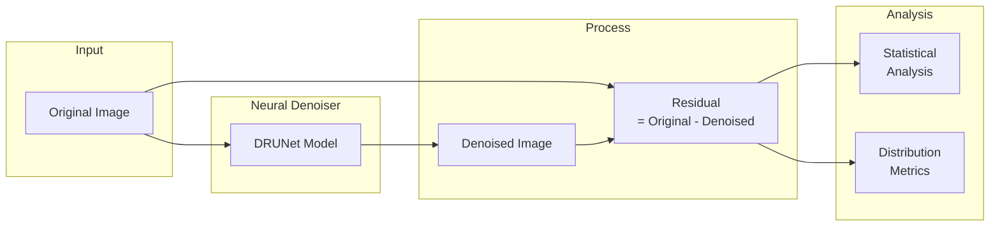

# Residual Analysis

Uses the DRUNet neural denoiser to extract and analyze image residuals (noise patterns) that can reveal generation artifacts.

---

## Overview

**Residual analysis** applies a neural network denoiser to an image and examines the "residual" — the difference between the original and denoised versions. This residual contains noise patterns that differ between real photographs and processed/generated images.

| Aspect | Detail |
|--------|--------|
| **Purpose** | Analyze noise patterns for authenticity cues |
| **Technique** | DRUNet deep learning denoiser |
| **Input** | Any common image format |
| **Output** | Residual statistics and distribution metrics |

---

## How It Works



### The Principle

Different image sources produce different noise characteristics:

| Source | Noise Characteristics |
|--------|----------------------|
| **Camera photos** | Sensor noise, shot noise, read noise |
| **AI-generated** | May be unnaturally clean or have artificial patterns |
| **Manipulated** | Mixed noise characteristics in different regions |
| **Heavily processed** | Smoothed or altered noise structure |

---

## Usage

### Tool Call Format

```
/path/to/image.jpg
```

### Output Format

```json
{
    "tool": "extract_residuals",
    "status": "completed",
    "image_path": "/path/to/image.jpg",
    "residual_mean": 0.0012,
    "residual_std": 8.45,
    "residual_skew": 0.23,
    "residual_kurtosis": 3.12,
    "residual_energy": 71.4,
    "residual_energy_mean": 0.0089,
    "residual_energy_std": 0.0034,
    "residual_energy_p95": 0.0156,
    "note": "DRUNet residual statistics for noise analysis..."
}
```

---

## Interpreting Results

### Key Metrics

| Metric | Meaning |
|--------|---------|
| `residual_mean` | Average residual value (should be near 0) |
| `residual_std` | Standard deviation — overall noise level |
| `residual_skew` | Distribution asymmetry |
| `residual_kurtosis` | Distribution peakedness (3 = normal) |
| `residual_energy` | Total noise energy |
| `residual_energy_p95` | 95th percentile energy (high values = anomalies) |

### What to Look For

**Authentic photographs typically show:**

- Moderate residual_std (sensor noise present)
- Near-zero skew (symmetric distribution)
- Kurtosis near 3 (normal-like distribution)
- Consistent energy across the image

**AI-generated images may show:**

- Very low residual_std (unnaturally clean)
- Abnormal distribution shape
- Unusual energy patterns

**Manipulated images may show:**

- Inconsistent statistics across regions
- Mixed noise characteristics
- Energy anomalies in edited areas

---

## Limitations

### Statistical Overlap

Residual statistics overlap significantly between authentic and fake images:

- Many authentic images are heavily processed (low noise)
- Many AI-generated images have realistic noise
- Statistical thresholds are not reliable

!!! warning "Corroborating Evidence Only"
    Use residual analysis as supporting evidence, not as a primary detector.

### Content Dependence

- Smooth regions have low residuals regardless of source
- High-frequency content shows higher residuals
- Comparison across content types is problematic

### Processing Effects

- Heavy compression destroys noise structure
- Sharpening and noise reduction alter residuals
- Social media processing confounds analysis

---

## Technical Details

### DRUNet Model

DRUNet (Dilated Residual U-Net) is a state-of-the-art blind denoiser:

- **Architecture**: U-Net with residual blocks and dilated convolutions
- **Training**: Trained on natural images with various noise levels
- **Property**: Removes structured noise while preserving signal

### Weight Location

Weights are automatically downloaded on first use:

```
src/tools/forensic/drunet/weights/drunet_gray.pth
```

### Pre-warming

For batch evaluation:

```python
from src.tools.forensic import prewarm_residual_extractor

# Pre-warm before multi-threaded evaluation
prewarm_residual_extractor()
```

---

## Forensic Applications

### Comparing Regions

For suspected splicing, compare residual statistics across regions:

```python
# Analyze suspicious region vs background
# Significant differences may indicate manipulation
```

### Baseline Comparison

If reference images from the same camera are available:

- Compare residual statistics
- Same camera should have similar noise characteristics
- Different source may indicate manipulation

---

## Best Practices

### For Analysis

1. **Use as supporting evidence** — Not definitive alone
2. **Compare similar content** — Different scenes have different residuals
3. **Consider processing history** — Compression affects results
4. **Look for inconsistencies** — More valuable than absolute values

### When Useful

| Scenario | Residual Analysis Value |
|----------|------------------------|
| Detecting AI generation | Moderate — some generators detectable |
| Splicing detection | Moderate — regional inconsistencies |
| Heavy compression | Low — noise structure destroyed |
| Original camera images | High — noise is a fingerprint |

---

## See Also

- [Frequency Analysis](frequency.md) — Complementary signal analysis
- [TruFor](trufor.md) — Primary manipulation detector
- [Tools Overview](overview.md) — Complete tool reference
