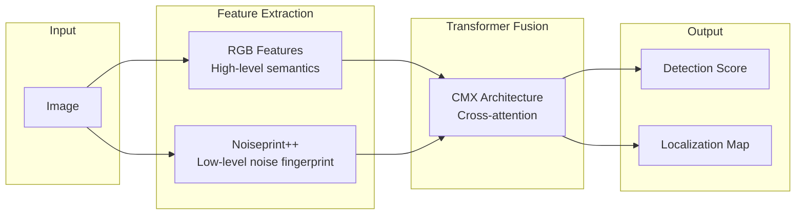

# TruFor

TruFor is an AI-driven neural forgery detection and localization tool that combines RGB features with Noiseprint++ through a transformer-based fusion architecture.

---

## Overview

**TruFor** (Trustworthy Forensics) is the primary manipulation detector in DF3. It was developed by the Research Group of University Federico II of Naples (GRIP-UNINA) and published at CVPR 2023.

| Aspect | Detail |
|--------|--------|
| **Purpose** | Detect and localize image manipulations |
| **Architecture** | Transformer fusion of RGB + Noiseprint++ |
| **Input** | Any common image format |
| **Output** | Manipulation probability (0-1), optional localization map |

---

## How It Works



### Key Components

1. **RGB Features** — High-level semantic features from the image
2. **Noiseprint++** — Low-level noise fingerprint sensitive to processing
3. **Transformer Fusion** — Combines both feature types via cross-attention
4. **Detection Head** — Produces overall manipulation probability
5. **Localization Head** — Pixel-wise manipulation map

---

## Usage

### Tool Call Format

```json
{"path": "/path/to/image.jpg"}
```

Or as plain string:

```
/path/to/image.jpg
```

### Output Format

```json
{
    "tool": "perform_trufor",
    "status": "completed",
    "image_path": "/path/to/image.jpg",
    "manipulation_probability": 0.15,
    "detection_score": 0.15,
    "localization_map": null,
    "localization_map_size": null,
    "note": "TruFor combines RGB features with Noiseprint++ for forgery detection..."
}
```

---

## Interpreting Results

### Manipulation Probability

| Score Range | Interpretation | Action |
|-------------|----------------|--------|
| **0.0 - 0.2** | Low manipulation evidence | Likely unedited |
| **0.2 - 0.4** | Some indicators | Minor concern, investigate |
| **0.4 - 0.6** | Moderate evidence | Probable manipulation |
| **0.6 - 0.8** | Strong evidence | Likely manipulated |
| **0.8 - 1.0** | Very strong evidence | Almost certainly manipulated |

### Important Caveats

!!! warning "TruFor Detects Manipulation, Not Synthesis"
    TruFor is designed to detect **post-hoc editing** — splicing, copy-move, inpainting, etc.
    
    - **Low score** means the image wasn't *edited* after creation
    - **Low score does NOT mean** the image is authentic
    - **AI-generated images** often score low because they were never manipulated
    
    For AI-generated images, rely on visual analysis and other indicators.

### When High Scores Are Meaningful

High TruFor scores are strong evidence when:

- Localized regions show high manipulation probability
- Score correlates with visually suspicious regions
- ELA also shows anomalies in the same regions
- Image content suggests editing (e.g., object insertion)

### When Low Scores Don't Mean "Real"

Low TruFor scores should be treated as neutral when:

- Image shows clear AI generation artifacts (anatomy, texture)
- Image is known to come from an AI generator
- Visual analysis suggests synthesis

---

## Localization Map

By default, DF3 disables the localization map to reduce output size. Enable it programmatically:

```python
from src.tools.forensic import perform_trufor
import json

# Request localization map
result = perform_trufor(json.dumps({
    "path": "image.jpg",
    "return_map": True
}))

output = json.loads(result)
# output["localization_map"] contains base64 PNG
```

### Map Interpretation

The localization map is a grayscale image where:

- **Bright regions** — High manipulation probability
- **Dark regions** — Low manipulation probability

```
Localization map for spliced image:
┌─────────────────────────────┐
│   Dark (authentic)          │
│   ┌───────────┐             │
│   │ BRIGHT    │ ← Spliced   │
│   │ (edited)  │   region    │
│   └───────────┘             │
│                             │
└─────────────────────────────┘
```

---

## Technical Details

### Model Architecture

TruFor uses the CMX (Cross-Modal Transformer) architecture:

- **Backbone**: SegFormer-based dual encoder
- **Fusion**: Transformer cross-attention
- **Decoder**: MLP-based segmentation head

### Model Weights

Weights are automatically downloaded on first use:

- **Location**: `weights/trufor/trufor.pth.tar`
- **Size**: ~180 MB
- **Source**: GRIP-UNINA official release

### GPU Acceleration

TruFor benefits significantly from GPU acceleration:

| Device | Typical Inference Time |
|--------|----------------------|
| CPU | 10-30 seconds |
| GPU (CUDA) | 1-3 seconds |

### Device Selection

Device is determined automatically:

1. Check `DF3_TRUFOR_DEVICE` environment variable
2. Use CUDA if available
3. Fall back to CPU

```powershell
# Force CPU mode
$env:DF3_TRUFOR_DEVICE = "cpu"

# Force specific GPU
$env:DF3_TRUFOR_DEVICE = "cuda:0"
```

---

## Pre-warming

For batch evaluation, pre-warm the model before starting workers:

```python
from src.tools.forensic import prewarm_trufor_model

# Pre-warm before multi-threaded evaluation
prewarm_trufor_model()
```

This avoids concurrent model loading issues.

---

## Limitations

1. **Manipulation focus** — Designed for editing detection, not synthesis detection
2. **Compression sensitivity** — Heavy JPEG compression can mask artifacts
3. **Resolution dependence** — Very small images may lack sufficient signal
4. **Novel techniques** — May not detect cutting-edge manipulation methods

---

## Citation

If you use TruFor in your research, please cite:

```bibtex
@InProceedings{Guillaro_2023_CVPR,
    author    = {Guillaro, Fabrizio and Cozzolino, Davide and Sud, Avneesh 
                 and Dufour, Nicholas and Verdoliva, Luisa},
    title     = {TruFor: Leveraging All-Round Clues for Trustworthy Image 
                 Forgery Detection and Localization},
    booktitle = {Proceedings of the IEEE/CVF Conference on Computer Vision 
                 and Pattern Recognition (CVPR)},
    month     = {June},
    year      = {2023},
    pages     = {20606-20615}
}
```

---

## See Also

- [ELA](ela.md) — Complementary compression-based detection
- [Tools Overview](overview.md) — Complete tool reference
- [Interpreting Results](../guide/interpreting-results.md) — Understanding tool outputs
